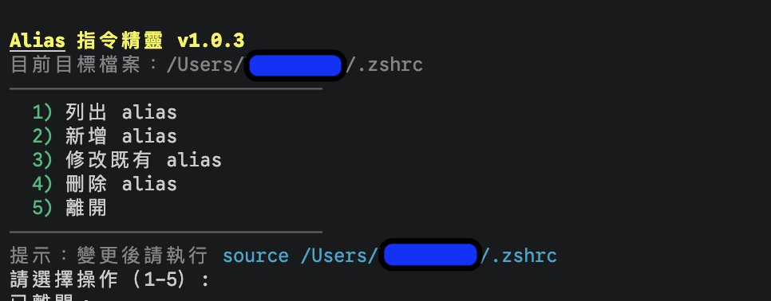

# alias-helper

互動式 Bash 精靈，用來管理 shell 設定檔中的 alias。



## 安裝方式

### 方式一：自動安裝（推薦）

需要先安裝 [GitHub CLI](https://cli.github.com) 並登入：

```bash
gh auth login  # 若尚未登入
bash <(curl -fsSL https://raw.githubusercontent.com/lazyjerry/alias-helper/master/install.sh)
```

安裝後即可直接執行：

```bash
alias-helper
```

> 腳本安裝至 `~/.local/bin/alias-helper`，請確認 `~/.local/bin` 已加入 `PATH`。

### 方式二：手動安裝

```bash
curl -fsSL https://raw.githubusercontent.com/lazyjerry/alias-helper/master/alias-helper.sh -o alias-helper.sh
chmod +x alias-helper.sh
./alias-helper.sh
```

## 功能

- 讀取預設目標檔案 `~/.zshrc`
- 目標檔案不存在時，可互動建立
- 列出目前 alias（彩色顯示）
- 新增 alias（若已存在則拒絕，提示改用修改）
- 修改既有 alias（名稱與內容分別編輯，留空保持不變）
- 刪除 alias
- 變更前自動備份，若語法檢查失敗會自動還原
- 新增/修改後可選擇添加或更新行內註解
- 特殊 alias 名稱（如 `cd`、`source`）會先警告
- 選單底部顯示 `source` 指令提示，方便手動套用變更

## 行為說明

- 預設寫入 `~/.zshrc`
- alias 名稱只允許英數、底線、點、減號
- 修改時名稱與內容皆可留空（保持原值不變），並在套用前顯示摘要供確認
- 重新載入前會先做語法檢查（`zsh -n` / `bash -n`）
- 腳本以子程序執行，無法直接影響目前 shell，需手動執行 `source ~/.zshrc`
- 主選單輸入空白直接離開

